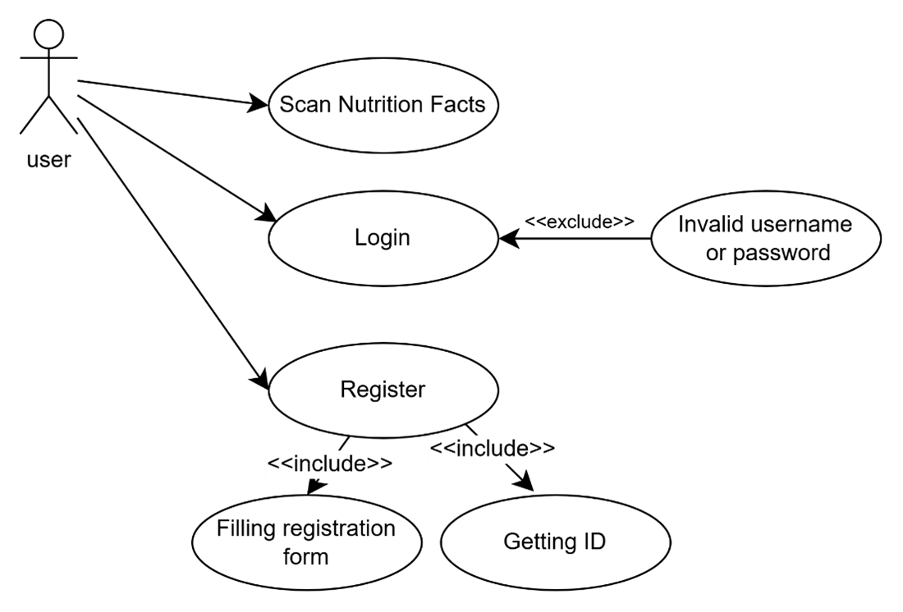
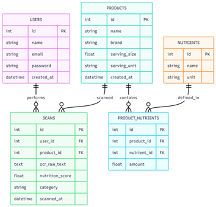
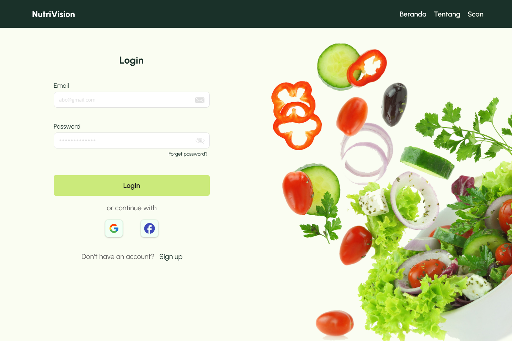
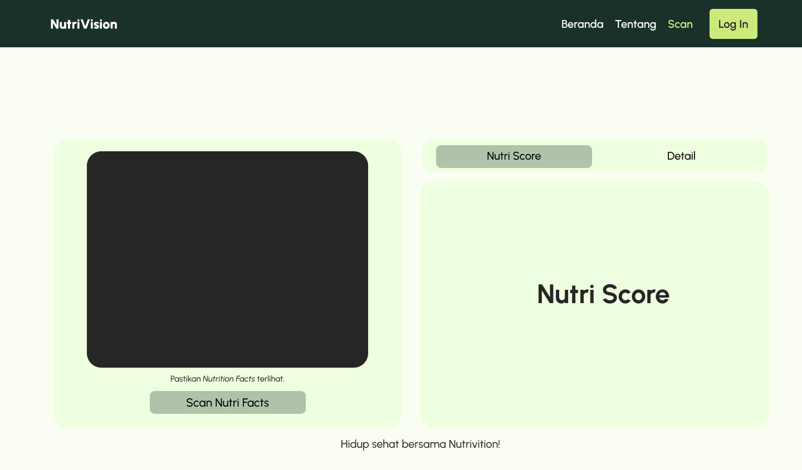
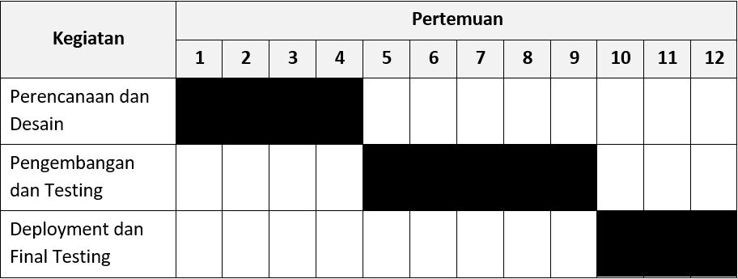

# NutriVision

## Nama Kelompok

Kelompok Sembilan Belas

## Anggota dan NIM

- Chaira Nastya Warestri — 23/514942/TK/56550
- Grace Anne Marcheline — 23/522362/TK/57654
- Faiz Arsyi Pragata — 23/518958/TK/57199

Project Senior Project TI

Departemen Teknologi Elektro dan Teknologi Informasi  
Fakultas Teknik  
Universitas Gadjah Mada

---

# Modul 1

## Tentang NutriVision

Aplikasi pendeteksi gizi instan berbasis web yang memanfaatkan teknologi AI.

## Latar Belakang & Permasalahan

Banyak orang kesulitan memahami tabel Nutrition Facts karena tampilannya kecil, padat, dan butuh dihitung manual. Akibatnya, pengguna sering tidak konsisten dalam mengevaluasi kualitas gizi produk yang mereka konsumsi.

## Ide Solusi

NutriVision membantu pengguna mengubah foto tabel Nutrition Facts menjadi insight gizi yang gampang dipahami. Cukup foto/unggah label gizi, AI akan mengekstrak data nutrisi dan menampilkan hasil analisis + skor gizi secara otomatis—tanpa hitung manual.

## Analisis Kompetitor (Minimal 3)

### 1) MyFitnessPal

- **Jenis:** Direct
- **Produk:** calorie-tracking & logging
- **Kelebihan:** database luas, integrasi perangkat fitness
- **Kekurangan:** pengalaman pengguna kurang terlokalisasi untuk Indonesia

### 2) FatSecret

- **Jenis:** Direct
- **Produk:** tracker nutrisi & komunitas diet
- **Kelebihan:** gratis dan lebih terlokalisasi
- **Kekurangan:** input data masih cenderung manual dan kurang praktis

### 3) HealthifyMe

- **Jenis:** Direct
- **Produk:** food tracker + AI health coach
- **Kelebihan:** coaching & personalisasi
- **Kekurangan:** banyak fitur berbayar dan lebih tersentralisasi untuk pasar tertentu

---

# Modul 2

## Tujuan Produk

- Membantu konsumen memahami informasi nilai gizi pada label kemasan makanan secara instan dan interaktif.
- Mengonversi data teks kecil pada kemasan menjadi indikator kesehatan yang mudah dipahami. :contentReference

## Pengguna Potensial & Kebutuhan

### Masyarakat Umum

Membutuhkan kemudahan membandingkan produk untuk memilih opsi lebih sehat.

### Pegiat Kebugaran

Membutuhkan data makronutrien akurat untuk mendukung target kebugaran.

---

## Use Case Diagram

---

## Functional Requirements

| ID  | Deskripsi                                      |
| --- | ---------------------------------------------- |
| FR1 | Sistem menangkap gambar label Nutrition Facts  |
| FR2 | Sistem menggunakan AI OCR untuk ekstraksi teks |
| FR3 | Sistem memproses data nutrisi terstruktur      |
| FR4 | Sistem menghitung nutrition score              |
| FR5 | Sistem menyimpan hasil scan                    |
| FR6 | Sistem menampilkan kategori kesehatan          |

---

## Entity Relationship Diagram

---

## Low-Fidelity Wireframe

### Login Page:

### Landing Page:

### Scan Page:

---

## Gantt Chart Proyek

---
